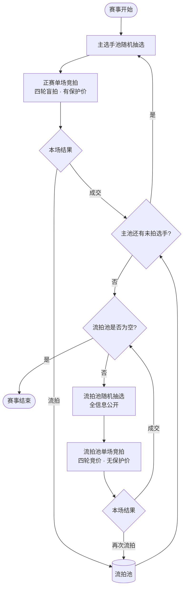
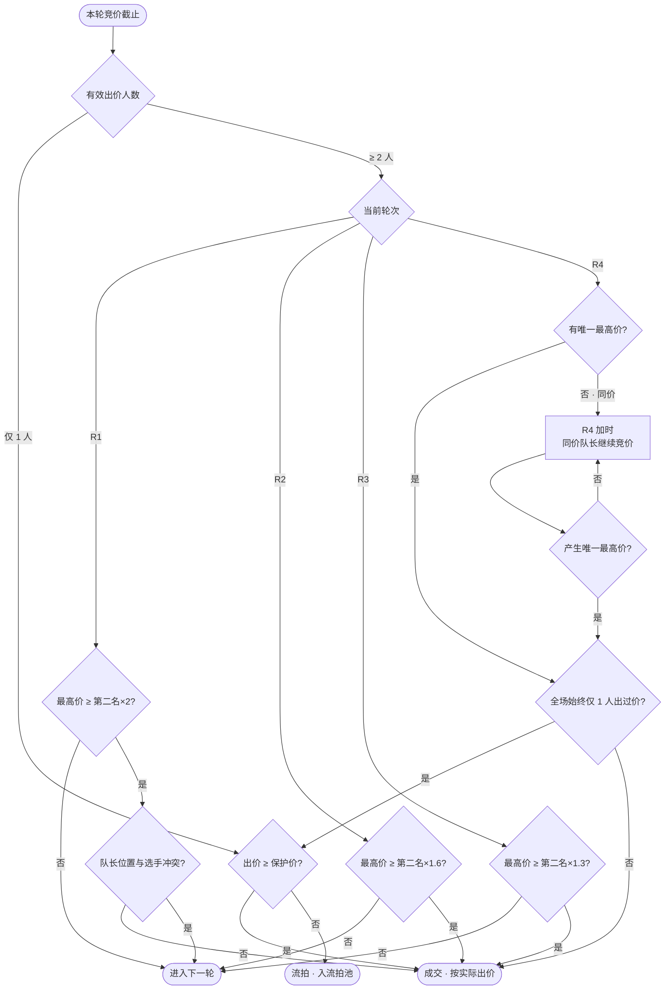
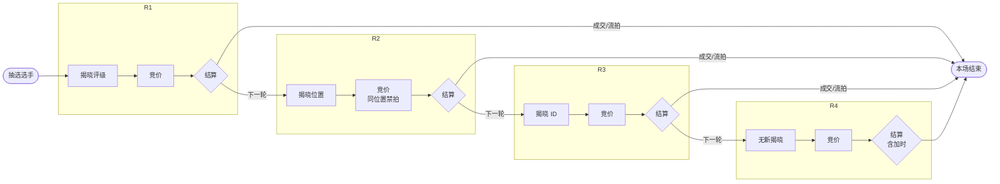
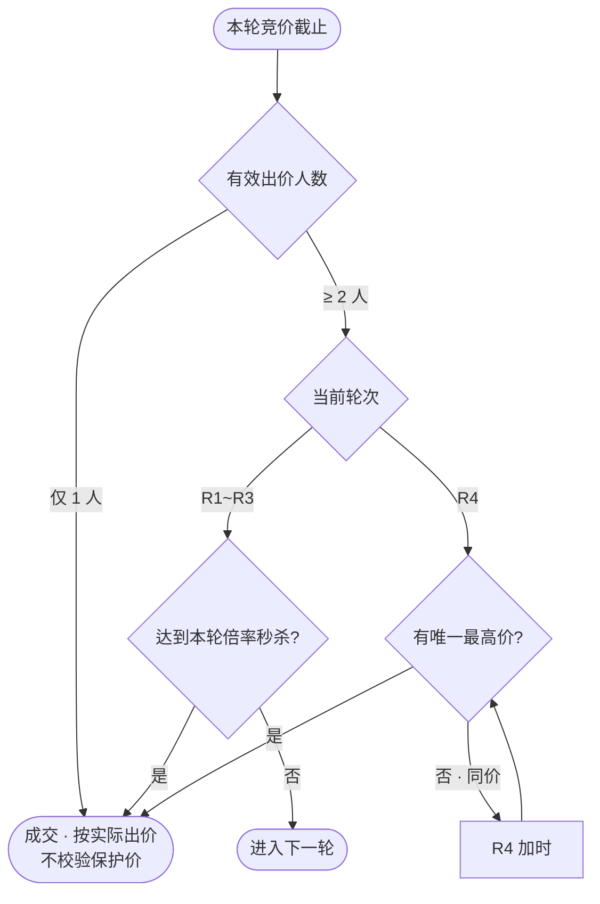

# 选手竞拍系统 — 产品需求文档（PRD）

**文档版本**：v1.2  
**创建日期**：2026-07-01  
**产品代号**：BidKing（百策竞拍）

---

## 1. 产品概述与目标用户

### 1.1 产品概述

BidKing 是一套面向**战队选秀 / 联赛组队**场景的**多轮盲拍竞拍系统**。系统分**正赛**与**流拍池补拍**两阶段：正赛从主选手池随机抽选，由 n 位队长在 4 轮递进式信息揭秘过程中同步出价；每轮根据「倍率领先即成交」规则判定是否结束竞拍，并处理首轮位置冲突等特殊回避逻辑。正赛中每位选手配置独立的**保护价**，仅在**全场仅一人出价**时生效：出价 ≥ 保护价则成交，否则流拍入池；多人竞价时按实际出价成交，不受保护价约束。主池全部拍完后，对流拍池选手进行**全信息公开、无保护价**的补拍。

核心体验：**信息逐步揭晓 + 同步竞价 + 倍率秒杀 + 单人保护价兜底 + 流拍补拍**，在公平性与策略性之间取得平衡。

### 1.2 产品目标

| 目标 | 说明 |
|------|------|
| **公平透明** | 竞拍规则、倍率阈值、位置冲突处理全程可见、可审计 |
| **策略深度** | 盲拍 + 分轮揭秘，鼓励队长根据有限信息做风险决策 |
| **流程高效** | 支持倍率秒杀提前结束，避免无效轮次竞价 |
| **可配置** | 队长数 n、倍率、选手保护价、轮次时长、选手池等可后台配置 |
| **单人兜底** | 仅一人出价时，出价 ≥ 该选手保护价则成交，否则流拍 |
| **实时同步** | 多队长同时出价，状态实时一致 |

### 1.3 目标用户

| 用户角色 | 画像 | 核心诉求 |
|----------|------|----------|
| **队长（Captain）** | 联赛/赛事中负责组队的 n 位战队负责人 | 在规则内高效拍得合适位置选手，看清每轮新信息后再决策 |
| **赛事管理员（Admin）** | 运营方、联赛组织者 | 配置规则、管理选手池、监控竞拍、处理异常 |
| **观众（Spectator）** | 直播/围观用户（可选） | 观看竞拍过程、查看历史与结果 |
| **系统（System）** | 自动执行逻辑的服务端 | 抽选选手、轮次推进、倍率判定、冲突检测、成交结算 |

### 1.4 业务场景

- 电竞联赛选秀（如 MOBA 位置上野中下辅）
- 企业内部战队赛 / 娱乐赛组队
- 任何需要「盲拍 + 分轮信息公开 + 多买家竞价」的选人场景

---

## 2. 详细功能列表

### 2.1 选手池与抽选

赛事包含两个选手来源：**主选手池**（正赛）与**流拍池**（补拍）。

| 功能 ID | 功能名称 | 描述 | 规则细节 |
|---------|----------|------|----------|
| F-001 | 选手池管理 | 维护主选手池与流拍池 | 字段：选手 ID、姓名/昵称、位置（上/野/中/下/辅）、评级（UR/SR/R/N 等）、保护价、状态（待拍/已成交/流拍/流拍池待拍） |
| F-002 | 正赛随机抽选 | 从**主选手池中所有未成交**选手随机抽取 1 人 | 已成交选手不再进入；流拍选手进入流拍池，不参与正赛抽选 |
| F-003 | 信息隐藏（仅正赛） | 正赛竞拍开始前及每轮揭晓前，未公开字段对队长不可见 | 初始：评级、位置、ID 均隐藏；流拍池补拍不适用（见 2.5） |
| F-004 | 流拍池管理 | 承接正赛流拍选手，主池拍完后开启补拍 | 流拍选手状态改为「流拍池待拍」；补拍从流拍池随机抽选 |

**保护价（仅正赛，按选手单独配置）**：

- **不设起拍价**；管理员为每位选手直接配置**保护价**（`protection_price`）
- 保护价**仅在该场竞拍「全场仅一人出价」时生效**（见 F-034）
- 多人竞价场景下，胜出者按**实际出价**成交，**不校验**保护价
- 流拍池补拍不适用保护价（F-035）

**评级枚举（示例）**：UR > SR > R > N（可配置排序与展示样式）

**位置枚举**：上、野、中、下、辅

**赛事阶段**：

```
阶段一（正赛）：主选手池抽选 → 四轮盲拍 → 成交 / 流拍入池
阶段二（流拍池补拍）：主池全部结束后 → 流拍池抽选 → 四轮竞价（无保密、无保护价）→ 成交 / 再次流拍
```

---

### 2.2 四轮竞拍核心流程

整体流程：

```
抽选选手 → R1 揭晓评级 → R1 竞价 → [判定] 
         → R2 揭晓位置 → R2 竞价 → [判定]
         → R3 揭晓选手 ID → R3 竞价 → [判定]
         → R4 无新信息 → R4 竞价 → [同价则加时] → [判定]
         → 成交（实际出价）/ 流拍入池（仅单人出价且低于保护价等）
主池拍毕 → 流拍池补拍（全信息公开、无保护价、四轮一致）→ 成交 / 再次流拍
```

| 轮次 | 本轮揭晓信息 | 倍率秒杀阈值 | 备注 |
|------|--------------|--------------|------|
| **R1** | 评级（UR~N） | **2.0 倍** | 需额外做**位置冲突检测**（见 2.4） |
| **R2** | 位置（上野中下辅） | **1.6 倍** | 同位置队长**禁止继续出价** |
| **R3** | 选手 ID | **1.3 倍** | — |
| **R4** | 无新增信息 | **最高价即成交** | 无倍率要求；同价进入加时（见 F-014） |

#### F-010 轮次状态机

每个竞拍场次状态：

`待开始 → R1_揭晓 → R1_竞价中 → R1_结算 → R2_揭晓 → … → R4_结算 → 已成交/流拍`

- **揭晓阶段**：展示本轮新增信息，倒计时后进入竞价
- **竞价阶段**：队长可提交/修改出价（可配置是否允许改价）
- **结算阶段**：计算是否秒杀 / 是否单人出价保护价校验 / 是否进入下一轮 / R4 加时 / 是否成交或流拍

#### F-011 同步出价

- n 位队长在同一轮次内**同时**出价（对同一选手）
- 服务端以**轮次截止时间**或**全员提交**（可配置）作为竞价结束条件
- 默认：**固定倒计时**（如每轮 60s），到时以最后一次有效出价为准

#### F-012 倍率秒杀判定

**通用公式**（R1~R3）：

> 若存在队长 A，其出价 ≥ 第二名出价 × 本轮倍率阈值，则 A **直接竞拍成功**，本场结束。

- 仅 **1 名队长**出价：**不触发倍率秒杀**；在该轮结算时执行**单人保护价校验**（F-034）——≥ 保护价则成交，< 保护价则流拍，**不进入下一轮**
- **2 人及以上**有效出价：按倍率秒杀规则判定；秒杀成功者按**实际出价**成交，**不校验**保护价
- **并列最高价**：不触发秒杀，进入下一轮；R4 同价则进入加时（见 F-014）
- **第二名出价为 0 / 未出价**：若仅一人有效出价，归入单人保护价逻辑；若两人及以上有效出价，按次高出价计算倍率

**R4**：无倍率秒杀。**最高价者**成交（多人竞价时按实际出价）；若出现并列最高价，触发**加时竞价**（F-014），直至产生唯一最高价后成交。R4 胜出时若全场自始至终仅一人出过价，仍须执行单人保护价校验（F-034）。

#### F-013 常驻倍率提示（UI）

每轮竞价界面**常驻显示**：

> 「若你的出价高于第二名 **{n}** 倍，则本轮回直接竞拍成功。」

- R1：n = 2.0  
- R2：n = 1.6  
- R3：n = 1.3  
- R4：「本轮回出价最高者成交；若与最高价相同，将进入加时。」

可动态计算并展示：**「当前第二名出价为 X，秒杀需 ≥ Y」**（Y = X × 倍率，仅 R1~R3）。

#### F-014 R4 同价加时

**触发条件**：R4 竞价截止后，存在**两名及以上**队长出价相同且为全场最高。

**规则**：

1. 所有**并列最高价**的队长进入加时轮（其他队长不可参与本轮加时）
2. 加时轮时长与正赛单轮竞价时长相同（默认 60s，可配置）
3. 加时截止后：
   - 若产生**唯一最高价** → 该队长胜出；若本场曾有多人出价则直接成交，若仅单人出价则执行保护价校验（F-034）
   - 若仍**并列最高价** → 再次加时，**循环直至区分出唯一最高价**
4. 加时期间仅并列队长可出价；未参与加时的队长不可补价

**UI 提示**：「R4 出现同价，队长 A、B 进入加时，直至决出最高价。」

---

### 2.3 特殊回避规则

#### F-020 R1 位置冲突检测（核心）

**背景**：R1 仅揭晓评级，**位置未公开**。可能出现「打野队长在 R1 以高倍秒杀成功，揭晓后发现选手也是打野」——与「同位置不可重复」的设计意图冲突。

**规则**：

1. R1 竞价结束，若触发**倍率秒杀**（某队长出价 ≥ 第二名的 2 倍）：
2. 系统**暂不成交**，执行**位置冲突检测**：
   - 读取该选手真实位置
   - 读取该队长**预设/绑定的位置**（队长在赛前已选定的位置，如「打野」）
3. **若位置相同（冲突）**：
   - **判定 R1 秒杀无效**，不成交
   - **直接进入 R2**（揭晓位置，进入 R2 竞价）
4. **若位置不同（无冲突）**：
   - R1 秒杀有效，该队长按**实际出价**成交（秒杀场景必有至少两人出价，**不校验**保护价）

**说明**：R1 冲突时，即使满足 2 倍也不成交，必须进入 R2；R2 起同位置队长已被排除，避免再次冲突。

#### F-021 R2 起同位置队长禁拍

- **R2 揭晓位置后**，与选手**同位置**的队长：
  - 不可在本场后续轮次（R2/R3/R4）**提交或修改出价**
  - UI 上标记为「位置冲突，不可竞价」
  - 若 R2 触发秒杀但该队长为同位置（理论上 R1 冲突已拦截，R2 不应出现同位置秒杀者仍有效的情况）：**该出价无效**，按未达标进入 R3

#### F-022 队长位置绑定

- 赛前：每位队长绑定一个位置（上/野/中/下/辅）
- 用于 R1 冲突检测与 R2 禁拍
- 管理员可后台修改（需留痕）

---

### 2.4 成交与结算

#### F-034 保护价校验（仅正赛 · 仅单人出价）

保护价按选手单独配置，**不设起拍价**。保护价**仅在全场仅有一名队长提交有效出价**时触发校验。

**触发条件**：某轮（R1~R4 或 R4 加时）竞价截止后，统计全场**有效出价队长数 = 1**。

| 条件 | 结果 |
|------|------|
| 唯一出价 **≥** 该选手保护价 | **成交**：按**实际出价**结算，选手归属该队长 |
| 唯一出价 **<** 该选手保护价 | **流拍**：本场不成交，选手进入**流拍池**（F-004） |

**不触发保护价校验的场景**（直接按竞价规则成交）：

- R1~R3 **倍率秒杀**成功（至少存在第二名出价，属多人竞价）
- R4（含加时）产生**唯一最高价**且本场曾有多人出价
- 流拍池补拍（F-035）

**说明**：

- 单人出价 + 未达保护价 → **当场流拍**，不进入后续轮次
- 单人出价 + 达到保护价 → **当场成交**，不进入后续轮次
- 保护价可在竞拍中对队长展示，提示：「若仅你一人出价，须 ≥ {保护价} 方可成交」

#### F-030 ~ F-033 结算功能

| 功能 ID | 功能名称 | 描述 |
|---------|----------|------|
| F-030 | 成交确认 | 竞价胜出或单人出价通过保护价校验后，选手状态改为「已成交」，绑定 winning_captain_id，记录实际成交价 |
| F-031 | 预算扣减 | 从队长剩余预算中扣除**实际成交价**（若业务有预算上限） |
| F-032 | 流拍 | 正赛：单人出价低于保护价，或四轮+加时结束仍无成交 / 全员未出价 → 选手进入流拍池；流拍池补拍：四轮+加时仍无法成交 → 标记再次流拍（可配置是否保留在池内） |
| F-033 | 竞拍记录 | 存每轮揭晓内容、各队长出价、保护价校验结果、加时记录、冲突检测日志 |

---

### 2.5 流拍池补拍

主选手池全部选手完成正赛（成交或流拍）后，自动进入**流拍池补拍阶段**。

#### F-035 流拍池补拍规则

| 维度 | 正赛 | 流拍池补拍 |
|------|------|------------|
| 抽选来源 | 主选手池 | 流拍池 |
| 信息揭晓 | R1→R4 分轮揭秘 | **抽选后立即公开全部信息**（评级、位置、ID），无保密环节 |
| 竞价轮次 | R1~R4 四轮 | **与正赛一致**（R1~R4 倍率、R4 最高价、R4 同价加时） |
| 分轮揭晓动画 | 有 | **无**（信息已全公开，直接进入 R1 竞价） |
| 保护价 | 有（按选手配置；仅单人出价时校验） | **无**，最高有效出价即成交价 |
| 位置回避 | R1 冲突检测 + R2 起同位置禁拍 | **与正赛一致**；因位置已公开，R2 起同位置队长从 R1 起即不可出价（或 R1 仍执行冲突检测作为兜底） |
| 成交条件 | 多人竞价：实际出价成交；单人出价：≥ 保护价成交 | 胜出即可成交，按实际出价 |

**流程**：

```
主池拍毕 → 流拍池非空? 
  → 是：从流拍池随机抽选 → 全信息展示 → R1~R4 竞价（同正赛规则，无保护价）→ 成交 / 再次流拍
  → 否：赛事结束
```

**UI 标识**：场次标题显示「流拍池补拍」；选手卡片一次性展示全部字段；不展示保护价提示。

---

### 2.6 管理员功能

| 功能 ID | 功能名称 | 描述 |
|---------|----------|------|
| F-040 | 赛事/场次创建 | 设置 n、队长列表、主选手池、各选手保护价、轮次时长、倍率（可覆盖默认） |
| F-041 | 开始/暂停/终止竞拍 | 人工干预异常场次；支持正赛 / 流拍池阶段切换 |
| F-042 | 选手池 CRUD | 导入、编辑、禁用选手；查看流拍池列表 |
| F-043 | 实时监控 | 当前轮次、出价、倒计时、冲突检测结果 |
| F-044 | 审计日志 | 操作人、时间、规则版本 |

---

### 2.7 队长端功能

| 功能 ID | 功能名称 | 描述 |
|---------|----------|------|
| F-050 | 登录/身份 | 队长账号与席位绑定 |
| F-051 | 竞拍大厅 | 当前场次、倒计时、已揭晓信息 |
| F-052 | 出价 | 输入金额，校验预算与 R2+ 位置权限 |
| F-053 | 历史与结果 | 本人历史出价、成交选手 |
| F-054 | 提示与规则说明 | 倍率提示、保护价提示、冲突说明、流拍池阶段说明 |

---

### 2.8 观众端（可选）

| 功能 ID | 功能名称 | 描述 |
|---------|----------|------|
| F-060 | 观战大屏 | 揭晓动画、出价排行（可隐藏具体金额仅显示排名） |
| F-061 | 回放 | 按场次查看轮次时间线 |

---

### 2.9 规则配置项（建议后台可配）

| 配置项 | 默认值 |
|--------|--------|
| R1~R3 倍率 | 2.0 / 1.6 / 1.3 |
| 保护价 | 按选手单独配置（无起拍价）；仅单人出价时校验 |
| 每轮竞价时长 | 60s |
| R4 加时竞价时长 | 60s（与单轮竞价相同） |
| 揭晓展示时长 | 5s（仅正赛） |
| 是否允许竞价期内改价 | 是 |
| R1 冲突后是否进入 R2 | 是（固定业务规则） |
| R4 同价处理 | **加时直至唯一最高价**（固定业务规则） |
| 流拍池补拍 | 主池结束后自动开启；无保密、无保护价 |
| 评级枚举与顺序 | UR, SR, R, N |
| 位置枚举 | 上, 野, 中, 下, 辅 |

---

## 3. 功能优先级

### 3.1 MVP（第一版，必须上线）

**目标**：完成正赛 + 流拍池补拍全流程，n 队长在线出价，规则正确可复现。

| 优先级 | 功能 |
|--------|------|
| P0 | 主选手池 + 流拍池 + 正赛随机抽选（F-001, F-002, F-003, F-004） |
| P0 | 四轮状态机：揭晓 → 竞价 → 结算（F-010） |
| P0 | 同步出价与倒计时（F-011） |
| P0 | R1~R4 倍率秒杀、R4 最高价及同价加时（F-012, F-014） |
| P0 | 保护价校验与流拍入池（F-034, F-032） |
| P0 | 流拍池补拍：全信息公开、无保护价、四轮一致（F-035） |
| P0 | R1 位置冲突检测 + 无效秒杀进 R2（F-020） |
| P0 | R2 起同位置队长禁拍（F-021, F-022） |
| P0 | 成交/选手状态更新（F-030, F-033） |
| P0 | 队长端：大厅 + 出价 + 倍率/保护价常驻提示（F-051, F-052, F-013, F-054） |
| P0 | 管理员：创建场次、导入选手、开始竞拍（F-040, F-042, F-041 基础） |
| P0 | 实时同步（WebSocket 或等效方案） |

**MVP 可暂不包含**：预算系统、观众端、复杂回放、多赛事并行。

---

### 3.2 V1.1（体验增强）

| 优先级 | 功能 |
|--------|------|
| P1 | 队长预算上限与扣减（F-031） |
| P1 | 管理员实时监控大屏（F-043） |
| P1 | 竞拍历史查询与导出 |
| P1 | 揭晓动画、音效 |
| P1 | 「当前秒杀所需金额 Y」动态计算展示 |
| P1 | 规则配置后台（倍率、时长）（2.8） |

---

### 3.3 V2.0（扩展）

| 优先级 | 功能 |
|--------|------|
| P2 | 观众观战与延迟公开出价（F-060） |
| P2 | 场次回放（F-061） |
| P2 | 多赛事并行、权限体系 |
| P2 | 移动端适配 / 小程序 |
| P2 | 数据分析：成交率、轮次分布、评级溢价 |
| P2 | anti-cheat：出价频率限制、异常登录告警 |

---

## 4. 界面设计要求

### 4.1 设计原则

- **信息分层**：未揭晓 / 已揭晓 / 本轮新增，视觉区分明确  
- **规则可见**：倍率提示常驻，不依赖队长记忆  
- **状态清晰**：轮次、倒计时、是否可出价、是否因位置被禁  
- **低误操作**：出价确认、大额二次确认（可选）  
- **大屏友好**：管理员/观众视图支持 1920×1080 投影  

### 4.2 队长端 — 竞拍主界面（核心）

**布局建议（桌面 Web）**：

```
┌─────────────────────────────────────────────────────────┐
│  场次：选秀第 3 场    当前：R2 竞价中    ⏱ 00:42        │
├─────────────────────────────────────────────────────────┤
│  【已揭晓】评级：SR    【本轮新增】位置：野              │
│  （R3/R4 再追加 ID 等）                                  │
├─────────────────────────────────────────────────────────┤
│  💡 若你的出价高于第二名 1.6 倍，则本轮回直接竞拍成功     │
│     当前第二名：800 → 秒杀需 ≥ 1280                       │
│  🛡 保护价：1250（仅你一人出价时须 ≥ 此价格方可成交）    │
├─────────────────────────────────────────────────────────┤
│  我的位置：打野   状态：✅ 可出价  （或 ❌ 位置冲突不可出价）│
│  出价：[________]  [提交]    剩余预算：5000              │
├─────────────────────────────────────────────────────────┤
│  其他队长：队长B 已出价 / 队长C 未出价 （不展示具体金额   │
│  或 MVP 仅展示自己的出价与是否已提交）                    │
└─────────────────────────────────────────────────────────┘
```

**状态与反馈**：

| 状态 | UI |
|------|-----|
| R1 冲突导致秒杀无效 | Toast + 文案：「位置冲突，R1 秒杀无效，进入第二轮」 |
| R2+ 同位置 | 出价区禁用 + 说明文案 |
| 单人出价低于保护价 | Toast：「仅你一人出价且低于保护价，选手流拍进入流拍池」 |
| 单人出价达到保护价 | 弹层：成交队长、实际成交价、选手信息 |
| R4 同价 | 横幅：「同价加时，队长 A、B 继续竞价」+ 加时倒计时 |
| 秒杀/竞价成功 | 全屏/弹层：成交队长、实际成交价、选手信息 |
| 流拍池补拍 | 顶部标识「流拍池补拍」；选手信息全展示；无保护价提示 |
| 进入下一轮 | 轮次切换动画 + 新信息高亮（正赛） |

### 4.3 管理员端

- **场次控制台**：开始抽选、暂停、强制结束、当前状态机节点  
- **选手池表格**：筛选、批量导入 CSV  
- **监控面板**：各队长出价时间线、冲突检测记录  
- **配置页**：倍率、时长、队长-位置绑定  

### 4.4 观众端 / 大屏（V2）

- 中央：当前选手已揭晓信息（逐步追加）  
- 侧栏：轮次进度条 R1→R4  
- 出价：仅显示「领先 / 秒杀达成」等抽象状态，避免剧透策略（可配置）  

### 4.5 视觉与交互

- 评级用色卡：UR 金、SR 紫、R 蓝、N 灰（可定制）  
- 位置用图标：上野中下辅  
- 倒计时最后 10s 高亮闪烁  
- 支持深色模式（长时间赛事）  

### 4.6 无障碍与国际化

- 关键状态不仅依赖颜色，配合图标与文案  
- 文案预留 i18n；数字与货币格式可配置  

---

## 5. 技术栈建议

### 5.1 推荐架构

```
[队长 Web / 管理 Web] ←→ [API Gateway] ←→ [竞拍服务] ←→ [PostgreSQL]
                              ↑                    ↓
                         [WebSocket]          [Redis]
                              ↑
                        [实时推送 / 房间状态]
```

### 5.2 技术选型（参考）

| 层级 | 建议 | 理由 |
|------|------|------|
| 前端 | **React + TypeScript + Vite** | 组件化、类型安全、生态成熟 |
| UI | **Tailwind CSS + shadcn/ui** 或 Ant Design | 快速搭建表单与表格 |
| 实时 | **WebSocket**（Socket.io / ws）或 **SSE + 轮次快照** | 多队长出价同步、倒计时 |
| 后端 | **Node.js (NestJS)** 或 **Go (Gin)** | 业务逻辑清晰；Go 更适合高并发倒计时 |
| 数据库 | **PostgreSQL** | 事务、审计、JSON 字段存轮次日志 |
| 缓存/锁 | **Redis** | 场次状态、分布式锁、倒计时、防重复提交 |
| 部署 | Docker + Nginx；云主机或 K8s | 易扩展 |
| 可选 | **Prisma / TypeORM** | ORM 与迁移 |

### 5.3 核心模块划分

| 模块 | 职责 |
|------|------|
| `AuctionEngine` | 状态机、轮次推进、倍率判定、R4 加时循环 |
| `ConflictChecker` | R1 位置冲突、R2+ 禁拍校验 |
| `BidValidator` | 预算、权限、截止时间 |
| `ProtectionPriceChecker` | 单人出价场景下的保护价校验、流拍入池 |
| `FailedPoolService` | 流拍池管理、补拍阶段抽选与规则差异 |
| `RevealService` | 正赛按轮次返回可见字段；补拍全量公开 |
| `RoomSync` | WebSocket 广播、重连恢复 |
| `AuditLogger` | 不可篡改竞拍日志 |

### 5.4 关键实现要点

1. **竞价截止**：以服务端时间为准；截止瞬间锁单，拒绝迟到出价  
2. **幂等**：`bid_id` + 场次 ID 防重复提交  
3. **重连**：客户端拉取 `GET /auction/{id}/snapshot` 恢复全状态  
4. **R1 冲突**：秒杀判定与冲突检测在同一事务内完成，避免中间态  
5. **保护价**：仅当有效出价人数 = 1 时校验；低于保护价原子性写入流拍池  
6. **R4 加时**：加时轮次递增计数持久化，支持重连恢复  
7. **规则版本**：场次创建时快照规则 JSON，避免赛后规则变更争议  

---

## 6. 非功能性需求

### 6.1 性能

| 指标 | 要求 |
|------|------|
| 出价 API P99 延迟 | ≤ 200ms（同区域） |
| WebSocket 广播延迟 | ≤ 500ms（n ≤ 20） |
| 单实例并发场次 | MVP：≥ 10 场并行；每场 n ≤ 16 |
| 倒计时精度 | 误差 ≤ 1s（服务端驱动） |
| 页面首屏 | ≤ 2s（4G / 普通宽带） |

### 6.2 可用性与可靠性

- 服务可用性目标：**99.5%**（赛事期间）  
- 竞拍状态持久化：Redis + DB 双写或写穿，故障可恢复  
- Graceful：管理员「暂停」冻结倒计时与出价  
- 备份：每日 DB 备份；关键场次日志不可物理删除（软删 + 审计）  

### 6.3 安全

| 项 | 要求 |
|----|------|
| 认证 | 队长/管理员 JWT 或 Session；席位与 token 绑定 |
| 授权 | 仅队长本人可为本队出价；管理员 RBAC |
| 防作弊 | 出价频率限制；IP/设备可选绑定；服务端校验一切规则 |
| 传输 | HTTPS / WSS |
| 敏感数据 | 未揭晓字段不得通过 API 泄露；日志脱敏 |
| 审计 | 所有出价、改价、管理员操作带 operator_id、timestamp |

### 6.4 数据一致性

- 成交结果以**服务端单次事务**为准：更新选手状态 + 写入成交记录 + 推送事件  
- 并发出价：乐观锁或 Redis 分布式锁按 `auction_id` 串行化结算  

### 6.5 可维护性

- 规则引擎配置化（倍率、轮次字段）  
- 结构化日志 + trace_id  
- 核心规则单元测试覆盖率 ≥ 90%（`AuctionEngine`、`ConflictChecker`）  

### 6.6 兼容性

- 浏览器：Chrome / Edge / Safari 最近两个 major 版本  
- 分辨率：队长端 ≥ 1280×720；管理端 ≥ 1440×900  

### 6.7 合规与运营

- 用户协议：虚拟竞价 / 娱乐赛事免责声明（若涉及）  
- 数据保留策略：场次数据保留 ≥ 1 年（可配置）  

---

## 7. 附录

### 7.1 核心流程（Mermaid）

#### 7.1.1 赛事总览



#### 7.1.2 正赛 · 单轮竞价结算（R1~R4 通用）

每轮竞价截止后，按以下顺序判定（R1~R3 有倍率秒杀；R4 无倍率，同价走加时）：



#### 7.1.3 正赛 · 四轮完整链路



> 注：R2~R4 的「结算」节点均遵循 **7.1.2** 的判定逻辑；R1 额外含位置冲突检测。

#### 7.1.4 流拍池补拍 · 单轮结算差异



> 流拍池场次抽选后**一次性公开**评级、位置、ID，无分轮揭晓；竞价轮次与倍率规则与正赛一致。

### 7.2 待产品确认项（Open Questions）

1. **竞价期内是否可见其他队长出价金额**，还是截止后一并揭晓？  
2. 是否有**预算上限**？MVP 是否必须？  
3. **流拍池补拍**中选手再次流拍，是否无限保留在池内重拍？  
4. 队长**位置**是否允许与选手位置相同但「替补规则」例外？当前 PRD 按严格冲突处理。  
5. **流拍池补拍**因位置已公开，R1 是否仍执行位置冲突检测，还是 R1 起即禁止同位置队长出价？  
6. **单人出价**判定是否包含「因位置冲突被禁拍后，实际仅剩一人可出价」的情况？当前 PRD 按**有效出价人数 = 1** 处理。

---

## 8. 文档修订记录

| 版本 | 日期 | 说明 |
|------|------|------|
| v1.0 | 2026-07-01 | 初稿：基于业务方提供的四轮盲拍与位置冲突规则 |
| v1.1 | 2026-07-01 | 新增保护价、R4 同价加时、流拍池补拍规则；R3 倍率调整为 1.3 |
| v1.2 | 2026-07-01 | 保护价改为按选手单独配置（取消起拍价与 1.25 倍率）；保护价仅在单人出价时生效 |
| v1.2.1 | 2026-07-01 | 重绘 Mermaid 流程图：拆分为赛事总览、单轮结算、四轮链路、流拍池差异四张图 |
